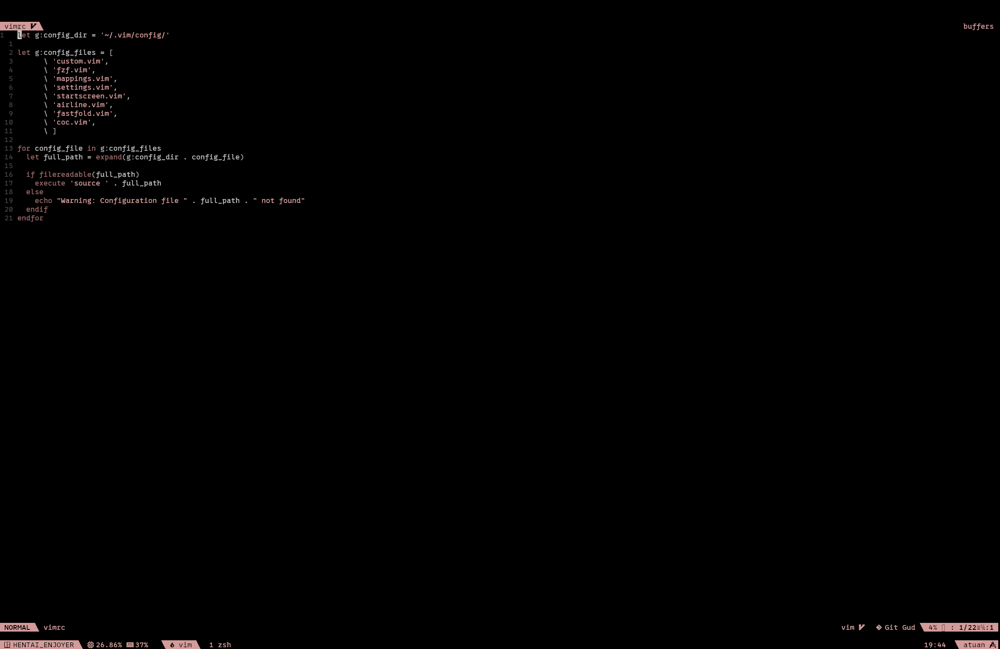
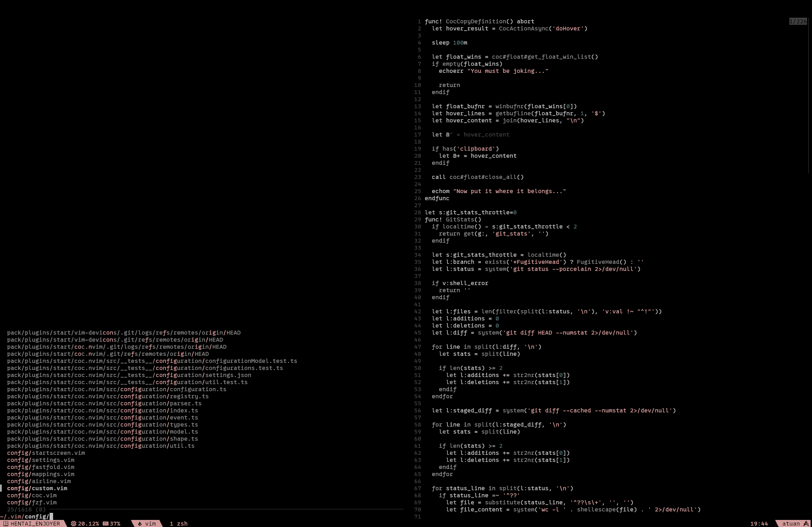

# Keta-powered Dotfiles

Welcome to my meticulously crafted dotfiles - named after my cat and optimized for pure coding joy! These configs turn your terminal into a productivity powerhouse without the bloat.

## What's Inside

A carefully curated selection of configurations for vim, tmux, zsh, and git that just work™. My vim setup is intentionally minimal - using Vim's native plugin management instead of third-party solutions because sometimes vanilla is the best flavor.

## Requirements

Before diving in, make sure you have:

- `git` - version control that powers everything
- `npm` - for CoC and other JavaScript tooling
- `fzf`, `bat`, `ripgrep`, `the_silver_searcher`, `perl`, `universal-ctags` - the fuzzy-finding dream team

Quick install of dependencies on macOS:

```bash
brew install git npm fzf bat ripgrep the_silver_searcher perl universal-ctags
```

## Installation

One command and you're flying:

```bash
curl -o- https://raw.githubusercontent.com/dorukozerr/dotfiles/main/install.sh | bash
```

What it does:

- Backs up your existing configs to `~/dotfiles_backup_<timestamp>/`
- Specifically backs up: `~/.vimrc`, `~/.vim/`, `~/.zshrc`, `~/.zprofile`, `~/.config/tmux/`, `~/.scripts/`, `~/.gitconfig`
- Sets up vim, tmux, zsh, git configurations
- Installs all necessary plugins

## Vim Plugins

My Vim setup uses a carefully curated set of plugins installed via Vim's native package management system:

### Core Functionality

- **vim-fugitive** - Git integration so seamless you'll forget it's a plugin
- **fzf & fzf.vim** - Lightning-fast fuzzy finding for files, buffers, and more
- **FastFold** - Speed optimization for code folding

### Development Tools

- **coc.nvim** - Intellisense engine for Vim, providing VSCode-like features
- **kisuke.vim** - My custom AI assistant for coding support
- **vim-jsx-pretty** - JSX syntax highlighting and indentation
- **typescript-vim** - TypeScript syntax support

### Visual Enhancements

- **vim-airline** - Lightweight yet informative status bar
- **vim-airline-themes** - Includes custom Keta theme for airline
- **vim-devicons** - Pretty icons for filetypes and directories

### CoC Extensions

**Language Servers:**

- `coc-vimlsp` - VimScript support
- `coc-sh` - Shell script support
- `coc-tsserver` - TypeScript/JavaScript support
- `coc-go` - Go language support
- `coc-html` - HTML support
- `coc-css` - CSS support
- `coc-json` - JSON support
- `coc-yaml` - YAML support
- `coc-lua` - Lua support
- `coc-sql` - SQL support
- `coc-svg` - SVG support

**Development Tools:**

- `coc-prettier` - Code formatting
- `coc-eslint` - JavaScript/TypeScript linting
- `coc-dotenv` - Environment variable support
- `@yaegassy/coc-tailwindcss3` - TailwindCSS support

All plugins are automatically installed during the dotfiles setup process. Run `:helptags ALL` after installation to generate help documentation.

## Important Notes

- The dotfiles contain my personal Git configuration. You **must** update `~/.gitconfig` with your own name and email before using.
- To achieve the exact look shown in the screenshots, set your terminal to use the Keta theme colors defined in the theme section below. All vim and tmux colors inherit from the terminal ANSI color definitions rather than being hardcoded.





## Keta Theme

A soft, pastel color scheme named after my cat, featuring gentle pinks and greens.

| Label          | Color Code | Preview                                           |
| :------------- | :--------- | :------------------------------------------------ |
| Background     | `#000000`  |  |
| Text           | `#FFFFFF`  |  |
| Bold Text      | `#FFFFFF`  |  |
| Cursor         | `#B56F88`  |  |
| Selection      | `#808080`  |  |
| Normal Black   | `#0A0A0A`  |  |
| Normal Red     | `#C55A5A`  |  |
| Normal Green   | `#7F6D9E`  |  |
| Normal Yellow  | `#B56F88`  |  |
| Normal Blue    | `#5E8C7A`  |  |
| Normal Magenta | `#9C6D9A`  |  |
| Normal Cyan    | `#78997C`  |  |
| Normal White   | `#F5F5F5`  |  |
| Bright Black   | `#606060`  |  |
| Bright Red     | `#D77272`  |  |
| Bright Green   | `#9989B8`  |  |
| Bright Yellow  | `#C7869E`  |  |
| Bright Blue    | `#7AAA98`  |  |
| Bright Magenta | `#B784B4`  |  |
| Bright Cyan    | `#93AF8A`  |  |
| Bright White   | `#EBEBEB`  |  |

## Keyboard Shortcuts

### Core Navigation & Editing

| Keys                        | Description                           | Mode  |
| :-------------------------- | :------------------------------------ | :---- |
| <kbd>Space</kbd>            | Leader key                            | `n`   |
| <kbd>j</kbd> <kbd>k</kbd>   | Exit insert mode                      | `i`   |
| <kbd>j</kbd> / <kbd>k</kbd> | Move down/up (respects line wrapping) | `n`   |
| <kbd>y</kbd> / <kbd>Y</kbd> | Copy to system clipboard              | `n/v` |

### File & Buffer Management

| Keys                                                     | Description                       | Mode |
| :------------------------------------------------------- | :-------------------------------- | :--- |
| <kbd>Leader</kbd> <kbd>s</kbd>                           | Save current buffer               | `n`  |
| <kbd>Leader</kbd> <kbd>t</kbd>                           | Open file explorer (Netrw)        | `n`  |
| <kbd>Leader</kbd> <kbd>p</kbd>                           | Find files (FZF)                  | `n`  |
| <kbd>Leader</kbd> <kbd>f</kbd>                           | Search in files (Ripgrep)         | `n`  |
| <kbd>Leader</kbd> <kbd>b</kbd> <kbd>b</kbd>              | Browse open buffers               | `n`  |
| <kbd>Leader</kbd> <kbd>b</kbd> <kbd>n</kbd>              | Next buffer                       | `n`  |
| <kbd>Leader</kbd> <kbd>b</kbd> <kbd>p</kbd>              | Previous buffer                   | `n`  |
| <kbd>Leader</kbd> <kbd>b</kbd> <kbd>d</kbd> <kbd>c</kbd> | Delete current buffer             | `n`  |
| <kbd>Leader</kbd> <kbd>b</kbd> <kbd>d</kbd> <kbd>a</kbd> | Delete all buffers except current | `n`  |
| <kbd>Leader</kbd> <kbd>b</kbd> <kbd>t</kbd>              | Toggle buffer maximize/restore    | `n`  |

### Window & Pane Control

| Keys                                                     | Description                | Mode |
| :------------------------------------------------------- | :------------------------- | :--- |
| <kbd>Leader</kbd> <kbd>i</kbd> <kbd>p</kbd> <kbd>w</kbd> | Increase pane width (+10)  | `n`  |
| <kbd>Leader</kbd> <kbd>d</kbd> <kbd>p</kbd> <kbd>w</kbd> | Decrease pane width (-10)  | `n`  |
| <kbd>Leader</kbd> <kbd>i</kbd> <kbd>p</kbd> <kbd>h</kbd> | Increase pane height (+10) | `n`  |
| <kbd>Leader</kbd> <kbd>d</kbd> <kbd>p</kbd> <kbd>h</kbd> | Decrease pane height (-10) | `n`  |

### Git Integration (Fugitive)

| Keys                                        | Description                 | Mode |
| :------------------------------------------ | :-------------------------- | :--- |
| <kbd>Leader</kbd> <kbd>g</kbd> <kbd>s</kbd> | Git status                  | `n`  |
| <kbd>Leader</kbd> <kbd>g</kbd> <kbd>a</kbd> | Git add all changes         | `n`  |
| <kbd>Leader</kbd> <kbd>g</kbd> <kbd>c</kbd> | Git commit (vertical split) | `n`  |
| <kbd>Leader</kbd> <kbd>g</kbd> <kbd>p</kbd> | Git push                    | `n`  |
| <kbd>Leader</kbd> <kbd>g</kbd> <kbd>d</kbd> | Git diff (vertical split)   | `n`  |
| <kbd>Leader</kbd> <kbd>g</kbd> <kbd>l</kbd> | Git log (vertical split)    | `n`  |

### Code Intelligence (CoC)

| Keys                                                        | Description                  | Mode    |
| :---------------------------------------------------------- | :--------------------------- | :------ |
| <kbd>g</kbd> <kbd>d</kbd>                                   | Go to definition             | `n`     |
| <kbd>g</kbd> <kbd>t</kbd>                                   | Go to type definition        | `n`     |
| <kbd>Ctrl</kbd> <kbd>j</kbd>                                | Trigger completion manually  | `i`     |
| <kbd>Ctrl</kbd> <kbd>k</kbd> <kbd>Ctrl</kbd> <kbd>i</kbd>   | Show hover documentation     | `n/i`   |
| <kbd>Ctrl</kbd> <kbd>f</kbd> / <kbd>Ctrl</kbd> <kbd>b</kbd> | Scroll floating windows      | `n/i/v` |
| <kbd>Leader</kbd> <kbd>c</kbd> <kbd>c</kbd> <kbd>d</kbd>    | Copy definition to clipboard | `n`     |

### AI Assistant (Kisuke)

| Keys                                                     | Description                       | Mode |
| :------------------------------------------------------- | :-------------------------------- | :--- |
| <kbd>Leader</kbd> <kbd>k</kbd> <kbd>o</kbd>              | Open Kisuke interface             | `n`  |
| <kbd>Leader</kbd> <kbd>k</kbd> <kbd>r</kbd> <kbd>s</kbd> | Resume last Kisuke session        | `n`  |
| <kbd>Leader</kbd> <kbd>k</kbd> <kbd>m</kbd>              | Mark current file for context     | `n`  |
| <kbd>Leader</kbd> <kbd>k</kbd> <kbd>h</kbd>              | Mark highlighted text for context | `v`  |
| <kbd>Leader</kbd> <kbd>k</kbd> <kbd>r</kbd> <kbd>c</kbd> | Remove last marked code block     | `n`  |
| <kbd>Leader</kbd> <kbd>k</kbd> <kbd>c</kbd>              | Create new Kisuke session         | `n`  |
| <kbd>Leader</kbd> <kbd>k</kbd> <kbd>d</kbd>              | Delete Kisuke session             | `n`  |

### Search & Replace

| Keys                                        | Description                                 | Mode |
| :------------------------------------------ | :------------------------------------------ | :--- |
| <kbd>Leader</kbd> <kbd>w</kbd> <kbd>r</kbd> | Replace word under cursor globally          | `n`  |
| <kbd>Leader</kbd> <kbd>p</kbd> <kbd>r</kbd> | Replace highlighted text with entered value | `v`  |
| <kbd>Leader</kbd> <kbd>p</kbd> <kbd>a</kbd> | Append to highlighted text pattern          | `v`  |
| <kbd>n</kbd> / <kbd>N</kbd>                 | Next/previous search result (auto-centered) | `n`  |

## Tmux Configuration

The tmux setup uses <kbd>Ctrl</kbd> <kbd>t</kbd> as the prefix key instead of the default <kbd>Ctrl</kbd> <kbd>b</kbd>. Copy mode is enabled with vi-style key bindings for natural vim-like navigation.

### Session Management

| Keys                           | Description  | Mode |
| :----------------------------- | :----------- | :--- |
| <kbd>Prefix</kbd> <kbd>K</kbd> | Kill session | `n`  |

### Copy Mode

| Keys                             | Description                     | Mode |
| :------------------------------- | :------------------------------ | :--- |
| <kbd>Prefix</kbd> <kbd>v</kbd>   | Enter copy mode                 | `n`  |
| <kbd>v</kbd>                     | Start selection                 | copy |
| <kbd>V</kbd>                     | Select entire line              | copy |
| <kbd>Ctrl</kbd> <kbd>v</kbd>     | Toggle rectangle selection      | copy |
| <kbd>y</kbd>                     | Copy to system clipboard & exit | copy |
| <kbd>q</kbd> / <kbd>Escape</kbd> | Exit copy mode                  | copy |

### Copy Mode Navigation

| Keys                                                        | Description              | Mode |
| :---------------------------------------------------------- | :----------------------- | :--- |
| <kbd>h</kbd> <kbd>j</kbd> <kbd>k</kbd> <kbd>l</kbd>         | Vi-style cursor movement | copy |
| <kbd>w</kbd> / <kbd>b</kbd> / <kbd>e</kbd>                  | Word navigation          | copy |
| <kbd>0</kbd> / <kbd>$</kbd> / <kbd>^</kbd>                  | Line navigation          | copy |
| <kbd>g</kbd> / <kbd>G</kbd>                                 | Go to top/bottom         | copy |
| <kbd>Ctrl</kbd> <kbd>f</kbd> / <kbd>Ctrl</kbd> <kbd>b</kbd> | Page down/up             | copy |
| <kbd>Ctrl</kbd> <kbd>d</kbd> / <kbd>Ctrl</kbd> <kbd>u</kbd> | Half page down/up        | copy |

### Copy Mode Search

| Keys                        | Description             | Mode |
| :-------------------------- | :---------------------- | :--- |
| <kbd>/</kbd> / <kbd>?</kbd> | Forward/backward search | copy |
| <kbd>n</kbd> / <kbd>N</kbd> | Next/previous match     | copy |

### Pane Management (No Prefix Required)

| Keys                                                               | Description       | Mode |
| :----------------------------------------------------------------- | :---------------- | :--- |
| <kbd>Alt</kbd> <kbd>h</kbd> <kbd>j</kbd> <kbd>k</kbd> <kbd>l</kbd> | Switch panes      | `n`  |
| <kbd>Alt</kbd> <kbd>←</kbd> <kbd>→</kbd> <kbd>↑</kbd> <kbd>↓</kbd> | Resize panes (±5) | `n`  |

All standard tmux window and pane management commands work with the <kbd>Ctrl</kbd> <kbd>t</kbd> prefix.

## WezTerm Keyboard Shortcuts

WezTerm is configured with intuitive keyboard shortcuts for terminal and tab management:

### Standard Controls

| Keys                        | Description          |
| :-------------------------- | :------------------- |
| <kbd>Cmd</kbd> <kbd>c</kbd> | Copy to clipboard    |
| <kbd>Cmd</kbd> <kbd>v</kbd> | Paste from clipboard |
| <kbd>Cmd</kbd> <kbd>=</kbd> | Increase font size   |
| <kbd>Cmd</kbd> <kbd>-</kbd> | Decrease font size   |
| <kbd>Cmd</kbd> <kbd>0</kbd> | Reset font size      |

### Tab & Window Management

| Keys                                         | Description       |
| :------------------------------------------- | :---------------- |
| <kbd>Cmd</kbd> <kbd>n</kbd>                  | New tab           |
| <kbd>Cmd</kbd> <kbd>w</kbd>                  | Close current tab |
| <kbd>Cmd</kbd> <kbd>Shift</kbd> <kbd>n</kbd> | New window        |

### Tab Navigation

| Keys                                         | Description       |
| :------------------------------------------- | :---------------- |
| <kbd>Cmd</kbd> <kbd>1-9</kbd>                | Switch to tab 1-9 |
| <kbd>Cmd</kbd> <kbd>Shift</kbd> <kbd>[</kbd> | Previous tab      |
| <kbd>Cmd</kbd> <kbd>Shift</kbd> <kbd>]</kbd> | Next tab          |

WezTerm launches in fullscreen mode and hides the tab bar when only one tab is open for a clean interface.
